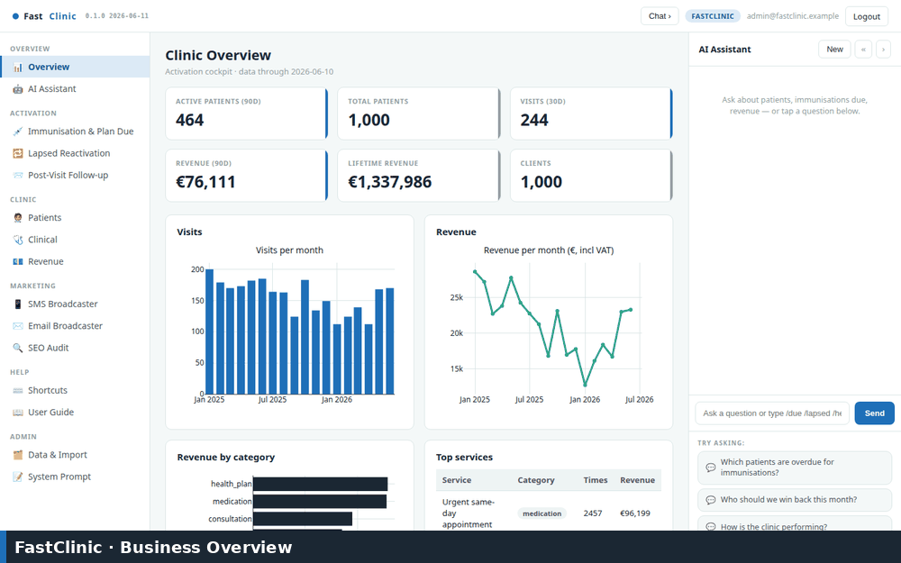

# FastClinic

**FastClinic** is an open-source **GP / general-practice marketing & activation
cockpit** — a FastHTML server-side web app that turns a clinic's own visit
history into prioritised patient-outreach lists. It is a working demonstrator
for a primary-care clinic's marketing and operations team: see who is due for an
immunisation, who has lapsed, and who just visited — with the message already
drafted.

Clinical palette: primary blue `#1e6fb8`, dark `#1b2733`, accent green
`#1f9d72`. Tagline *"Modern primary care, made personal."* Runs on port **5005**.

> **Synthetic data only — no PHI.** FastClinic ships and runs on fully
> synthetic patient data generated by `pms/synth.py`. There is no real patient
> data anywhere in this repository, and the cockpit treats its database as
> read-only.

## Demo

A click-through of the key screens (regenerate any time with
`scripts/build_demo_gif.sh`):



## Quickstart

```bash
# 1. Create a virtualenv and install dependencies
python -m venv .venv
.venv/bin/python -m pip install -r requirements.txt

# 2. Generate synthetic data, then build the read-only SQLite DB
.venv/bin/python -m pms.synth        # writes data/synthetic_fastclinic.xlsx
.venv/bin/python -m pms.importer     # builds fastclinic.sqlite

# 3. Run the cockpit
.venv/bin/python web_app.py          # http://localhost:5005
```

Login: `admin@fastclinic.example` / `FastClinic2026$` (override via
`FASTCLINIC_ADMIN_*`, see `.env.sample`).

## Module tour

- **Overview / Cockpit** — KPI cards (active / total patients, visits, revenue,
  clients), visit & revenue trends, a searchable patient list with detail
  drilldown, clinical view (diagnoses & clinician activity), and revenue by
  category.
- **Activation engines** — the core. Three engines that surface *exactly who to
  contact, why, and when*, each a reviewable list with an English message draft
  and CSV export (**no auto-send**):
  - **Immunisation & health-check reminders** — patients due/overdue for a
    recurring service (immunisations, annual health checks, repeat
    prescriptions).
  - **Lapsed reactivation** — patients with no visit in N months, ranked by
    lifetime value.
  - **Post-visit follow-up** — recent visits to check in on and rebook.
- **Marketing** — an **SMS Broadcaster** (Twilio / VoodooSMS), an **Email
  Broadcaster** (Postmark), and an **LLM SEO/GEO audit suite** (10 core + 5
  generative-engine-optimisation components) that writes dated reports.
- **AI assistant** — a LangGraph agent over read-only clinic data with a
  configurable model provider, plus fast slash-commands: `/kpi`, `/due`,
  `/lapsed`, `/followup`, `/revenue`, `/patient`.
- **Accounting agent** — a clinic-bookkeeping demo (`scripts/accounting_agent.py`)
  that runs over **synthetic** supplier invoices.
- **Eval pack** — an offline regression suite that rebuilds a fresh DB from the
  synthetic export and runs command, chat, and HTTP-route checks.

## Data

`pms/synth.py` generates `data/synthetic_fastclinic.xlsx` (a structurally
realistic, fully synthetic PMS export). `pms/importer.py` builds a **read-only**
SQLite database (`fastclinic.sqlite`) from it; re-run either step to refresh.
The cockpit shows a graceful "No data loaded" screen until a DB exists.

See **[SKILLS.md](SKILLS.md)** for the full capability reference and
**[CLAUDE.md](CLAUDE.md)** for the architecture. `docs/` holds the user guide and
the FastHTML audit.

## Deploy

`Dockerfile` (python:3.12-slim, port 5005). `docker-compose.yml` mounts a
`fastclinic-data` volume at `/data` so the database lives outside the image.
Configure via `.env` (see `.env.sample`).

## Licence

MIT. See `LICENSE`.
