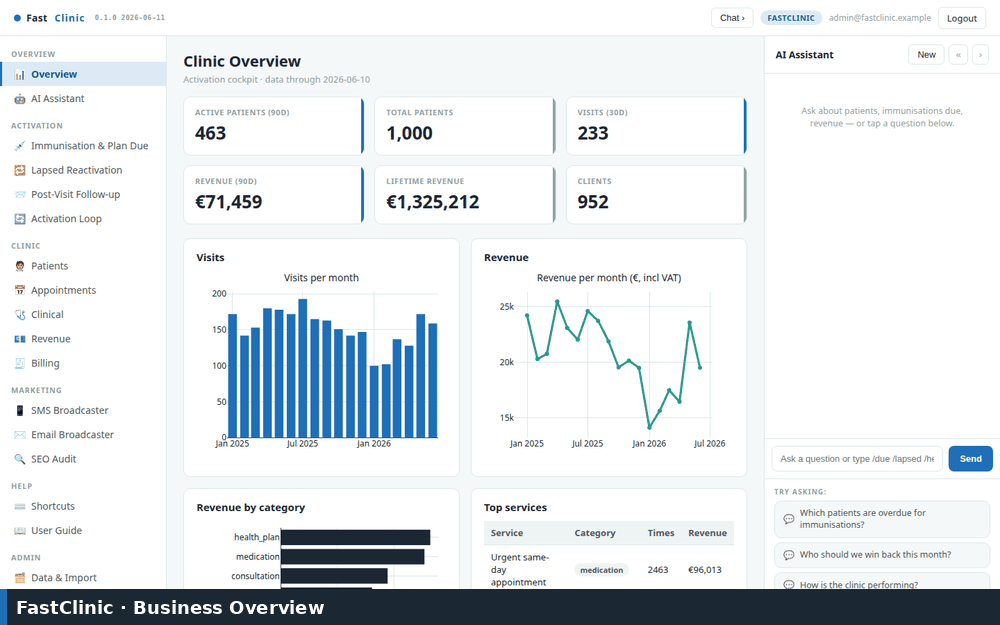

# FastClinic

**FastClinic** is an open-source **multi-specialty clinic operations platform** —
a FastHTML server-side web app that runs the back office of a modern clinic
spanning **general practice, surgical specialties** (orthopaedics, ophthalmology,
ENT, general surgery, gynaecology, urology, dermatology, plastics, cardiology,
gastroenterology) **and dental care**. It brings the operational core a practice
runs on into one workspace: case mix and revenue across departments, appointments
with real availability, fee invoicing with a balanced ledger, and patient recall —
on a patient/contact people model that reaches minors through a guardian.

Clinical palette: primary blue `#1e6fb8`, dark `#1b2733`, accent green
`#1f9d72`. Tagline *"Modern clinical care, made personal."* Runs on port **5005**.

> **Synthetic data only — no PHI.** FastClinic ships and runs on fully
> synthetic patient data generated by `pms/synth.py`. There is no real patient
> data anywhere in this repository. Imported clinical facts are read-mostly;
> the typed API permits narrow, validated synthetic-data mutations.

## Demo

A click-through of the key screens (regenerate any time with
`scripts/build_demo_gif.sh`):



## Quickstart

```bash
# 1. Create a virtualenv and install dependencies
python -m venv .venv
.venv/bin/python -m pip install -r requirements.txt

# 2. Generate synthetic data, then build the SQLite clinical DB
.venv/bin/python -m pms.synth        # writes data/synthetic_fastclinic.xlsx
.venv/bin/python -m pms.importer     # builds fastclinic.sqlite

# 3. Run the cockpit
.venv/bin/python web_app.py          # http://localhost:5005
```

Sign in at `/login` with Google or a verified local account. For local demos and
automation, `.env.sample` documents an explicitly enabled bootstrap account;
it is stored and authenticated through the same account system and is disabled
by default.

## Module tour

- **Overview / Cockpit** — KPI cards (active / total patients, visits, revenue,
  contacts), visit & revenue trends, a searchable patient list with detail
  drilldown, clinical view (diagnoses & clinician activity), and revenue by
  category.
- **Treatments & Specialties** — the operations lens: **case mix, volume and
  revenue across every department** (GP, orthopaedics, ophthalmology, ENT,
  general surgery, gynaecology, urology, dermatology, plastics, cardiology,
  gastroenterology, dental, diagnostics), surgical throughput, and top procedures
  by revenue. Every line item is classified along two axes — *what* it is
  (consultation, surgery, dental, diagnostic, procedure…) and *which specialty*
  delivered it.
- **Appointments** — booking into **real availability** with conflict detection
  (a clinician can't be double-booked), confirmation states, and an automatic
  reminder the day before.
- **Billing** — per-consultation **fee invoices**, part/full payments, and a live
  **balanced double-entry ledger**. The payer is tracked separately from the
  patient, so a parent's (or insurer's) invoice for a patient is handled naturally.
- **Recall & scheduling** — clinical recall that keeps patients in the loop, each
  a reviewable list with a drafted message and CSV export (**no auto-send**):
  immunisations and reviews **due** (with **age/cohort-aware** intervals), **lapsed
  patients** ranked by lifetime value, and **post-op / post-visit follow-up**. The
  **Recall Loop** closes it — queue, send by SMS/email, and every attempt is
  **logged (sent / failed / blocked-for-consent)** with a measured **return rate**.
- **Communications** — an **SMS** (Twilio / VoodooSMS) and **Email** (Postmark)
  sender, both with automatic opted-out suppression, plus a **web-presence audit**
  suite that writes dated reports.
- **AI assistant** — a LangGraph agent over read-only clinic data with a
  configurable model provider, plus fast slash-commands: `/kpi`, `/due`,
  `/lapsed`, `/followup`, `/revenue`, `/patient`.
- **People model** — patients (the *subject* of care) and contacts (the
  contactable/consenting/billing *party*) are modelled separately with a role
  link, so a minor is reached through a **guardian**, not their own phone.
- **Eval pack** — an offline regression suite (157 checks) that rebuilds a fresh
  DB from the synthetic export and covers commands, chat, routes, consent, the
  people model, the multi-specialty taxonomy, recall, appointments, and billing.
- **User guide** — a landscape guide with a screenshot per feature:
  [PDF](docs/fastclinic_user_guide_2026-08-14.pdf) ·
  [PPTX](docs/fastclinic_user_guide_2026-08-14.pptx), rebuilt from one shared
  source with matching page/slide numbers using
  `scripts/build_user_guide.sh`.

## Data

`pms/synth.py` generates `data/synthetic_fastclinic.xlsx` (a structurally
realistic, fully synthetic PMS export). `pms/importer.py` builds the clinical
database from it, modelling patients (the *subject* of care) and contacts
(the *party*) as separate entities linked by role; re-run either step to refresh.
Operational state the cockpit writes—accounts, chat, reminders, appointments,
communications, invoices, payments, ledger and audit—lives in separate tables
so refreshing the clinical import never wipes it. Production can keep all of
these tables in `DATABASE_URL_PROD`/`fast_clinic` by setting
`FASTCLINIC_OPS_BACKEND=postgresql`; SQLite remains available for local tests.
Migrate legacy operations and account files additively with
`python scripts/migrate_ops_to_postgres.py`. The cockpit shows a graceful "No
data loaded" screen until clinical records exist.

See **[SKILLS.md](SKILLS.md)** for the full capability reference,
**[CLAUDE.md](CLAUDE.md)** for the architecture, and
**[docs/CLINIC_OS_PLAN.md](docs/CLINIC_OS_PLAN.md)** for the Clinic OS design,
roadmap, and interoperability plan, and
**[docs/FASTHEALTHDATA_INTEGRATION_PLAN.md](docs/FASTHEALTHDATA_INTEGRATION_PLAN.md)**
for the governed secondary-use/research integration boundary. `docs/` also holds
the user guide and the FastHTML audit.

## Deploy

`Dockerfile` (python:3.12-slim, port 5005). `docker-compose.yml` mounts a
`fastclinic-data` volume at `/data` so the database lives outside the image.
Configure via `.env` (see `.env.sample`).

The clinical model is selectable with `FASTCLINIC_DATABASE_BACKEND=sqlite` or
`postgresql`. PostgreSQL reads `DATABASE_URL_PROD` (with `DATABASE_URL` as a
fallback) and is isolated to `FASTCLINIC_DB_SCHEMA=fast_clinic`. Migrate the
current synthetic SQLite data transactionally with:

```bash
python scripts/migrate_clinical_to_postgres.py --schema fast_clinic
```

The command verifies row counts, relationships, and treatment revenue, and
refuses to replace existing tables unless `--replace` is supplied. Operational
state (sessions, chat, appointments, reminders, billing, and audit events)
remains separate SQLite state via `FASTCLINIC_OPS_DB`.

## Integration API

The typed API is mounted at `/api`, with human documentation at `/developers`,
Swagger UI at `/api/docs`, ReDoc at `/api/redoc`, and OpenAPI JSON at
`/api/openapi.json`. It covers clinical records, subject/party relationships,
appointments and availability, activation and consent, immutable communication
logs, balanced billing and payments, analytics, the API audit trail, and a
FHIR R4 read surface (`/api/v1/fhir/*`) with an NHS adapter
(`/api/v1/adapters/GB/*`) that applies UK Core profiles and a GP Connect STU3
translation. Live PDS / GP Connect calls stay gated until onboarding.

Public reads operate only over the synthetic demo surface. Operational reads and
all mutations require `Authorization: Bearer <FASTSME_API_TOKEN>` and remain
disabled when that variable is blank. FastBooking uses the separate
least-privilege `FASTBOOKING_API_TOKEN`. Destructive HTTP methods use domain-safe
semantics: clinical records are archived, bookings/reminders are cancelled,
payments are refunded, and invoices are voided with reversing ledger entries.

## Public landing translations

The landing page, account modal, and developer documentation support English,
Estonian, German, French, Swedish, Latvian, Norwegian, Danish, Polish, Dutch,
Finnish, and Lithuanian. Browser language is detected on the first visit and a
top-right language menu persists the visitor's choice in their session.

Translations are checked-in JSON and production never calls a translation
service. After changing public copy, check or explicitly refresh the catalogues:

```bash
python scripts/update_i18n.py
python scripts/update_i18n.py --translate
python -m unittest discover -s tests -v
```

## Evaluations

Deterministic application/data gates and live DeepEval LLM-judge benchmarks are
documented in [`evals/README.md`](evals/README.md). The live suite covers grounded
agent answers, tool routing, all supported response languages, clinical safety,
privacy, prompt injection, robustness, streaming, and conversation memory.

Authenticated chat conversations retain a bounded recent history in the
operations database, scoped by account and thread. Starting a new chat creates a
fresh thread; retention and context limits are configurable in `.env.sample`.

## Licence

MIT. See `LICENSE`.
