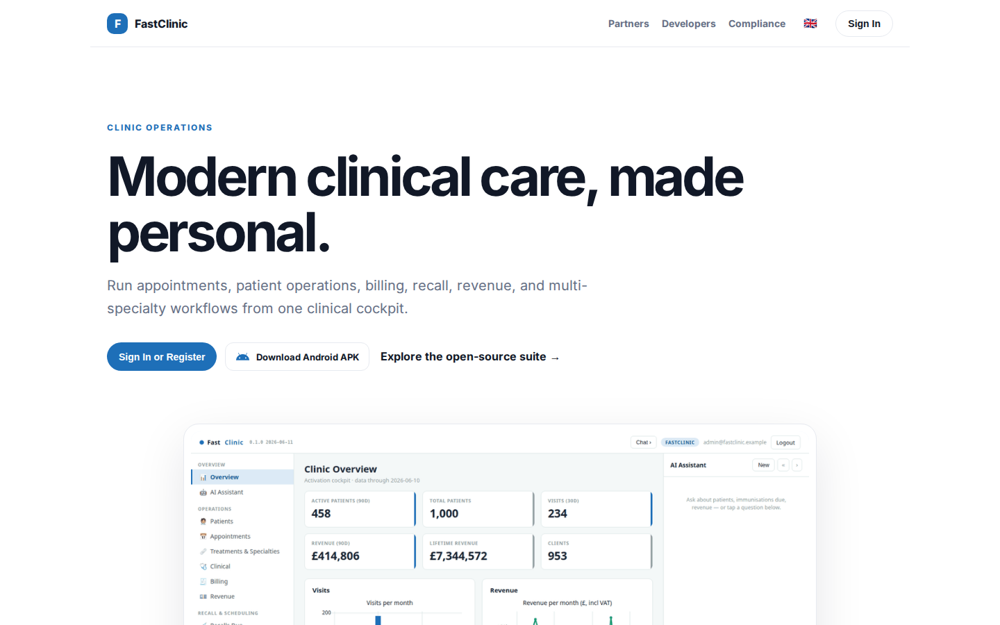
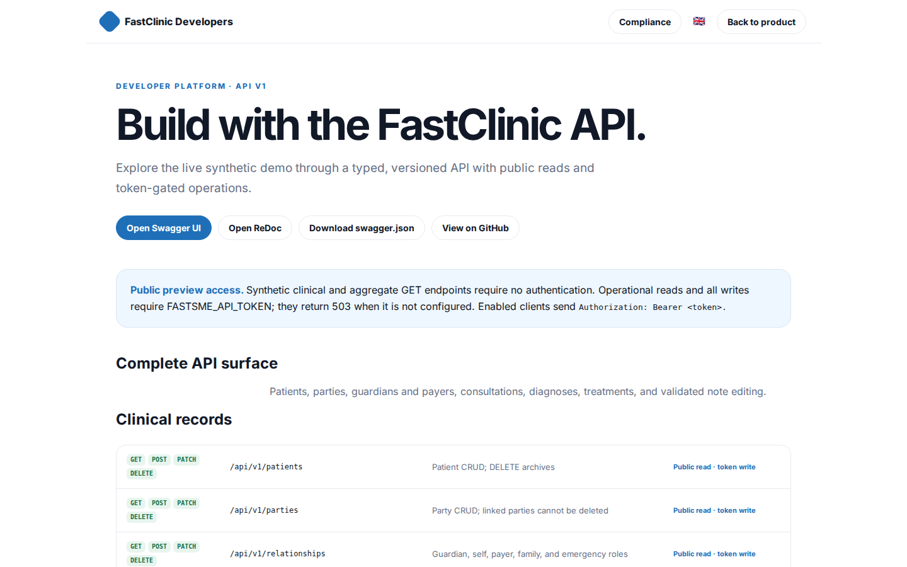
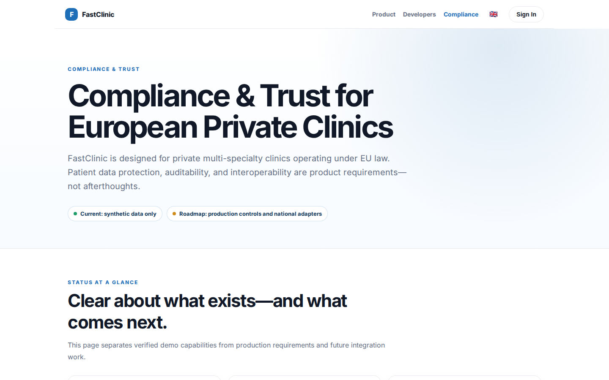

# FastClinic Platform Guide

**Published:** 2026-08-19
**Platform:** [https://clinic.fastsme.com](https://clinic.fastsme.com)
**Source:** [github.com/predictivelabsai/FastClinic](https://github.com/predictivelabsai/FastClinic)

## Platform overview

**FastClinic** is an open-source **multi-specialty clinic operations platform** — a FastHTML server-side web app that runs the back office of a modern clinic spanning **general practice, surgical specialties** (orthopaedics, ophthalmology, ENT, general surgery, gynaecology, urology, dermatology, plastics, cardiology, g

This visual guide was reviewed against the live product using Playwright. Screens and available navigation can vary by account, role, and deployment configuration.

## 1. Modern clinical care, made personal.

CLINIC OPERATIONS Modern clinical care, made personal. Run appointments, patient operations, billing, recall, revenue, and multi-specialty workflows from one clinical cockpit. Sign In or Register Download Android APK Explore the open-source suite → Product tou

Screen reviewed at: [https://fastclinic.dev/](https://fastclinic.dev/)

## 2. Build with the FastClinic API.

FastClinic Developers Compliance 🇬🇧 Back to product DEVELOPER PLATFORM · API V1 Build with the FastClinic API. Explore the live synthetic demo through a typed, versioned API with public reads and token-gated operations. Open Swagger UI Open ReDoc Download swag

Screen reviewed at: [https://fastclinic.dev/developers](https://fastclinic.dev/developers)

## 3. Compliance & Trust for European Private Clinics

COMPLIANCE & TRUST Compliance & Trust for European Private Clinics FastClinic is designed for private multi-specialty clinics operating under EU law. Patient data protection, auditability, and interoperability are product requirements—not afterthoughts. Curren

Screen reviewed at: [https://fastclinic.dev/compliance](https://fastclinic.dev/compliance)

## 4. Modern clinical care, made personal.

CLINIC OPERATIONS Modern clinical care, made personal. Run appointments, patient operations, billing, recall, revenue, and multi-specialty workflows from one clinical cockpit. Sign In or Register Download Android APK Explore the open-source suite → Product tou

Screen reviewed at: [https://fastclinic.dev/](https://fastclinic.dev/)

## Getting started

Visit [https://clinic.fastsme.com](https://clinic.fastsme.com) to explore FastClinic. For source code and deployment details, use the GitHub link above.
