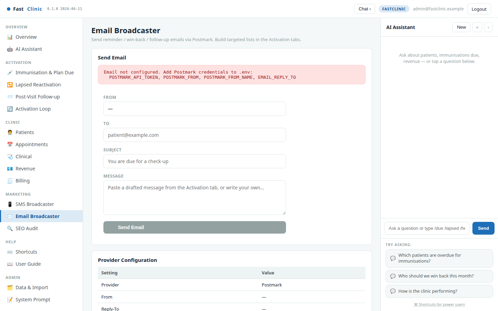

::: cover

# FastClinic

#### User Guide — Run, Grow & Activate Your Practice

**Modern primary care, made personal.**

A patient-activation & operations cockpit for GP / general practice

fastclinic.example

:::

---

## Contents

**Get started**

1. What FastClinic is & how it grows your practice — *the Overview*
2. Sign in & the 3-pane layout
3. The AI Copilot — just ask

**Activate — bring patients back**

4. Immunisation & Plan Due
5. Lapsed Reactivation
6. Post-Visit Follow-up
7. The Activation Loop — queue, send, measure

**Run the clinic**

8. Appointments & booking
9. Patients &nbsp;·&nbsp; 10. Patient profile &nbsp;·&nbsp; 11. Clinical &nbsp;·&nbsp; 12. Revenue &nbsp;·&nbsp; 13. Billing & payments

**Reach & connect**

14. SMS Broadcaster &nbsp;·&nbsp; 15. Email Broadcaster &nbsp;·&nbsp; 16. AI Assistant &nbsp;·&nbsp; 17. SEO / GEO Audit &nbsp;·&nbsp; 18. Data & Import

**Run it every week**

19. The weekly playbook & measuring impact

---

## What FastClinic is & how it grows your practice

**FastClinic** is an all-in-one workspace for a GP practice: a place to see the
whole clinic at a glance *and* an activation engine that turns your own visit
history into more booked appointments and revenue. The **Overview** is your
weekly scorecard — active and total patients, recent visits, revenue and trends,
all dated so you always know how fresh the picture is.

It runs a simple, repeatable **activation loop**:

1. **See** — the cockpit ranks who is due, lapsed, or recently seen.
2. **Reach** — a message is drafted for you; you review and send by SMS or email.
3. **Book** — patients return for the immunisation, health check, or review.
4. **Measure** — return visits are attributed back, so you see what worked.

Recurring care is predictable: every patient you re-activate becomes due again
next year, so a steady weekly cadence compounds into a growing, healthier list.

---

## Sign in & the layout

Open **fastclinic.example** and sign in with your practice login. The screen then
has **three panes** that stay consistent everywhere:

- **Left** — navigation, grouped by job: *Overview · Activation · Clinic ·
  Marketing · Help · Admin*.
- **Centre** — the workspace: lists, tables, charts and forms.
- **Right** — the **AI Copilot**, always on hand to answer questions about your
  data. It can be collapsed to give the workspace more room.

Everything is server-rendered and fast; if you can read a list and press a button,
you can run the whole clinic from here.

> **Your data stays private.** FastClinic reads your practice's own records and
> never contacts a patient without you pressing send.

---

## The AI Copilot — just ask

The **Copilot** on the right turns plain questions into answers from your live
data. Ask *"Which patients are overdue for immunisations?"*, *"Who should we win
back this month?"* or *"How is the clinic performing?"* and it replies with a
ready-to-read table.

Power users can type **slash-commands** for instant results — `/due`, `/lapsed`,
`/followup`, `/revenue`, `/patient 1206` — no waiting, no clicks. The suggested
questions under the box are a good starting point.

---

## Immunisation & Plan Due

The first activation engine surfaces **exactly who is due or overdue** for a
recurring service — childhood and adult immunisations, annual health checks, and
repeat-prescription reviews — ranked most-overdue first.

Recall intervals are **age- and cohort-aware**: a flu booster for an over-65, a
childhood immunisation, and a medication review each follow their own schedule
rather than a one-size-fits-all rule. Each row comes with a drafted reminder
message and can be exported or sent straight to the broadcaster.

---

## Lapsed Reactivation

Good patients drift away quietly. **Lapsed Reactivation** lists everyone with no
visit in the last *N* months, ranked by lifetime value so you win back the most
valuable relationships first. Adjust the window (6 / 12 / 24 months) to widen or
tighten the net. A warm "we miss you" message is drafted for each patient.

---

## Post-Visit Follow-up

Care doesn't end when the patient leaves. **Post-Visit Follow-up** lists recent
visits so you can check in on recovery, prompt a review, or rebook — within a
window you choose (7 / 14 / 30 / 60 days). It's the personal touch that turns a
one-off visit into an ongoing relationship.

---

## The Activation Loop — queue, send, measure

This is what closes the loop. **Queue due reminders** turns the lists above into
tracked reminders. Every message you then send is **logged** — sent, failed, or
**blocked because the patient opted out of marketing** — so nobody is contacted
twice by accident and consent is always respected.

The scorecard at the top tracks pending reminders, messages sent, blocked
(opted-out) contacts, and the **return rate**: how many contacted patients came
back within 30 days. That last number is the whole point — proof the activation
work is bringing patients through the door.

---

## Appointments & booking

Book patients into **real availability**. Pick a clinician and day and the
schedule shows every slot, free or taken. Booking checks for conflicts, so a
clinician can **never be double-booked**; the same time on another clinician is
still free. Confirm or cancel with one click, and every booking automatically
queues a reminder the day before.

---

## Patients

A fast, searchable list of the whole patient base — search by name, town, or NHS
number. Each row shows visits, last-seen date and lifetime value, so the people
who matter most are easy to find. Click any patient to open their profile.

---

## Patient profile

A single view of one patient: demographics and contact, lifetime value and visit
count, the full consultation history, and recent billed items — everything the
team needs before a call or a visit, on one screen.

---

## Clinical

The clinical picture across the practice: the most common diagnoses and a
breakdown of activity by clinician. Useful for spotting trends, planning services,
and understanding where the clinical workload sits.

---

## Revenue

Where the money comes from: revenue by service category and the monthly trend.
See at a glance which services drive income and how the practice is tracking over
time — the financial companion to the activation work.

---

## Billing & payments

Raise **fee invoices** against consultations, record **part or full payments**,
and watch the numbers stay honest: a live **balanced ledger** underneath means
every pound billed and collected is accounted for. Because the payer is tracked
separately from the patient, a parent's invoice for a child's treatment — or an
insurer's — is handled naturally.

---

## SMS Broadcaster

Send text reminders through your SMS provider. Paste in a drafted message from any
activation list, or write your own. Opted-out patients are **automatically
suppressed** at the point of sending, so a campaign never reaches someone who has
asked not to be contacted.

---

## Email Broadcaster

The same, for email. Compose a subject and body — or reuse a drafted message — and
send through your email provider, with the same automatic consent protection.
Ideal for longer, friendlier win-back and follow-up notes.

---

## AI Assistant

A full-page version of the Copilot for deeper questions. Ask about patients,
immunisations due, revenue or activation opportunities in plain language and get
answers grounded in your live data — a knowledgeable colleague who has read every
record.

---

## SEO / GEO Audit

Grow the *top* of the funnel too. The audit suite checks how well your practice
shows up in search and in AI answer engines, and writes dated reports you can act
on — so new patients can find you as easily as existing ones come back.

---

## Data & Import — keep the records fresh

FastClinic works from your practice-management export. This page shows what's
loaded — patients, contacts, consultations and more — and how to refresh it when a
new export arrives. When contact details are included, campaign lists are ready to
send; without them, lists identify patients by reference for you to match.

---

## The weekly playbook & measuring impact

**A simple weekly rhythm keeps the practice growing:**

1. **Monday — See.** Open the Overview, then the three activation lists. Skim who
   is due, lapsed, and recently seen.
2. **Reach.** Queue due reminders on the Activation Loop, review the drafted
   messages, and send by SMS or email. Opted-out patients are handled for you.
3. **Book.** As patients reply, book them into Appointments — no double-booking,
   with a reminder queued automatically.
4. **Measure.** At week's end, check the Activation Loop's **return rate** and the
   Overview's active-patient and revenue trends.

**What to watch:** active patients, return rate, and revenue trend. Each patient
re-activated this year becomes due again next year, so the base of returning
patients — and the revenue that comes with it — compounds week over week.

> **The one question FastClinic answers every day:** *"Which patients should we
> contact today to grow the practice — and what do we say?"*
