::: cover

# FastClinic

#### User Guide — Run Your Multi-Specialty Clinic

**Modern clinical care, made personal.**

General practice · surgical specialties · dental — one operations platform

fastclinic.example

:::

---

## Contents

**Get started**

1. What FastClinic is — the operations cockpit
2. Sign in & the 3-pane layout
3. The AI Copilot — just ask

**Run the clinic**

4. Treatments & Specialties — the case-mix lens
5. Appointments & booking
6. Patients &nbsp;·&nbsp; 7. Patient profile &nbsp;·&nbsp; 8. Clinical
9. Revenue &nbsp;·&nbsp; 10. Billing & payments

**Keep patients in the loop**

11. Recalls Due
12. Lapsed Patients &nbsp;·&nbsp; 13. Post-Visit Follow-up
14. The Recall Loop — queue, send, measure

**Reach & connect**

15. SMS &nbsp;·&nbsp; 16. Email &nbsp;·&nbsp; 17. AI Assistant &nbsp;·&nbsp; 18. Web Presence
19. Data & Import — keep the records fresh

**Run it every week**

20. The weekly playbook

---

## What FastClinic is — the operations cockpit

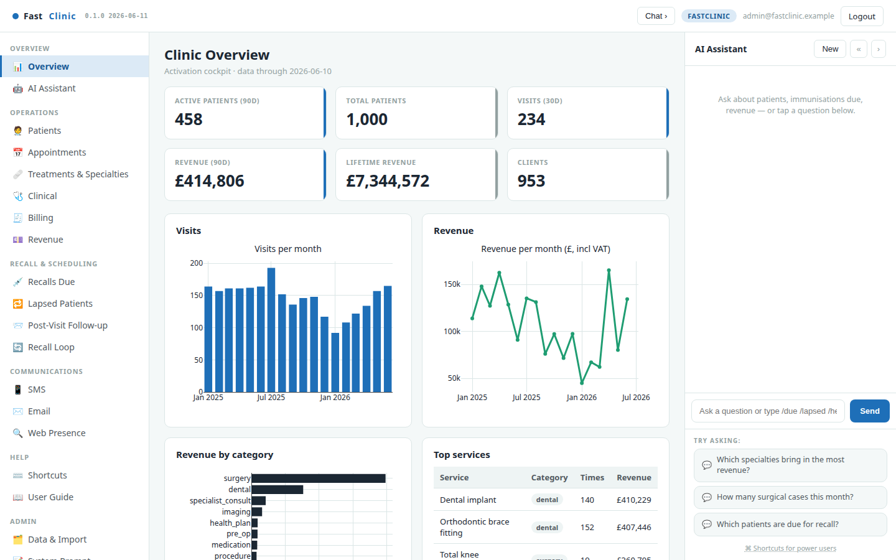

**FastClinic** runs the back office of a **multi-specialty clinic** — general
practice, surgical specialties (orthopaedics, ophthalmology, ENT, general surgery,
gynaecology, urology and more) and dental care — in one workspace. The **Overview**
is your daily scorecard: active and total patients, recent visits, revenue and
trends, all dated so you always know how fresh the picture is.

Everything the clinic runs on is here: the **case mix and revenue** across every
department, **appointments** booked into real availability, **billing** with a
balanced ledger, and **patient recall**. It's built for the whole operations team
— reception, practice managers, and finance — not just clinicians.

---

## Sign in & the layout

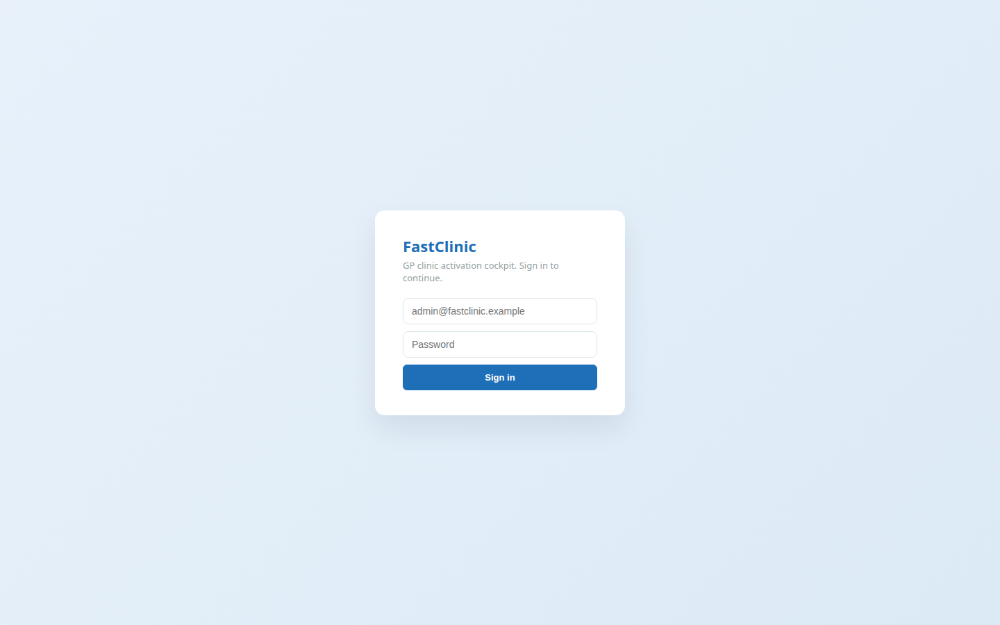

Open **fastclinic.example** and sign in with your clinic login. The screen then
has **three panes** that stay consistent everywhere:

- **Left** — navigation, grouped by job: *Overview · Operations · Recall &
  Scheduling · Communications · Admin*.
- **Centre** — the workspace: lists, tables, charts and forms.
- **Right** — the **AI Copilot**, always on hand to answer questions about your
  clinic. It can be collapsed to give the workspace more room.

Everything is server-rendered and fast; if you can read a list and press a button,
you can run the clinic from here.

---

## The AI Copilot — just ask

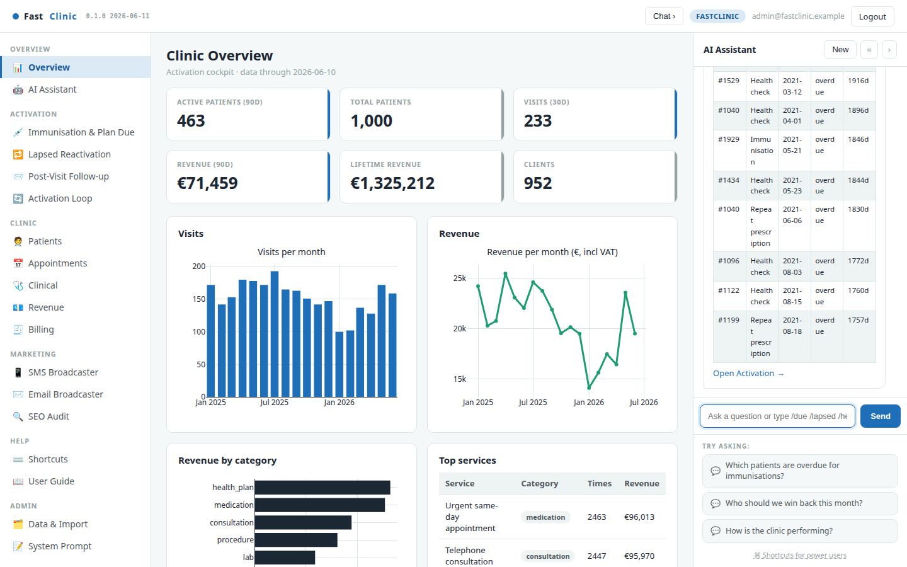

The **Copilot** on the right turns plain questions into answers from your live
data. Ask *"Which specialties bring in the most revenue?"*, *"How many surgical
cases this month?"* or *"Which patients are due for recall?"* and it replies with a
ready-to-read table.

Power users can type **slash-commands** for instant results — `/kpi`, `/due`,
`/lapsed`, `/followup`, `/revenue`, `/patient 1206`. The suggested questions under
the box are a good starting point.

---

## Treatments & Specialties — the case-mix lens

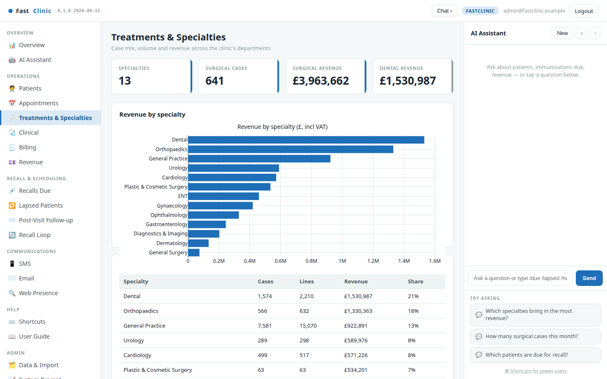

This is the operations heart of the platform. Every treatment is classified on two
axes — *what* it is (consultation, **surgery**, **dental**, diagnostic,
procedure…) and *which specialty* delivered it — so you can see the whole clinic at
a glance: **revenue and case volume across every department**, surgical
throughput, and the **top procedures** driving income.

Use it to understand where the work and the money are — which specialties are
growing, how much surgical and dental activity you're doing, and which procedures
matter most. It's the view a practice manager opens first.

---

## Appointments & booking

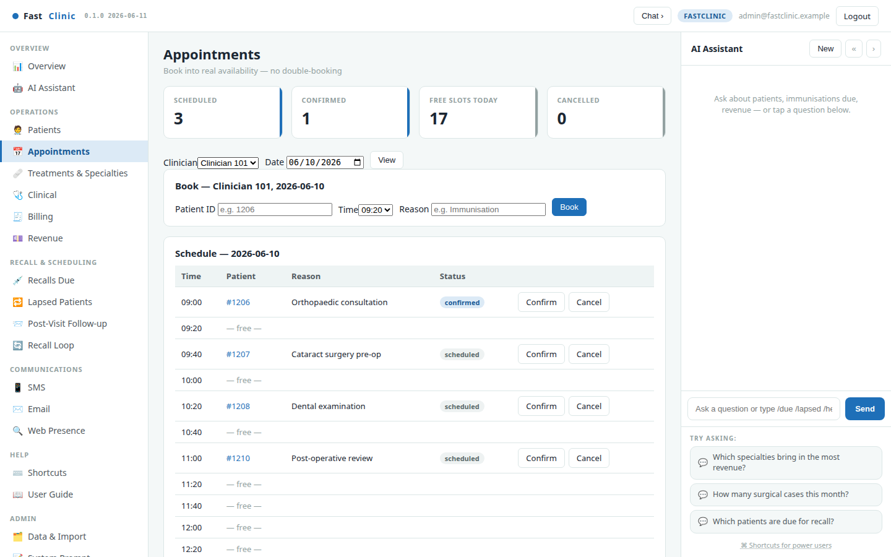

Book patients into **real availability**. Pick a clinician and day and the
schedule shows every slot, free or taken. Booking checks for conflicts, so a
clinician can **never be double-booked**; the same time on another clinician is
still free. Confirm or cancel with one click, and every booking automatically
queues a reminder the day before.

---

## Patients

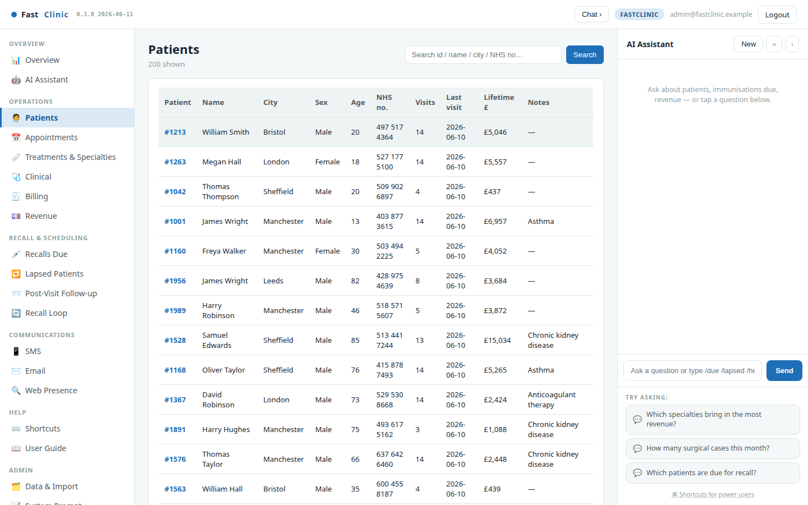

A fast, searchable list of the whole patient base — search by name, town, or NHS
number. Each row shows visits, last-seen date and lifetime value, so the people
who matter most are easy to find. Click any patient to open their profile.

---

## Patient profile

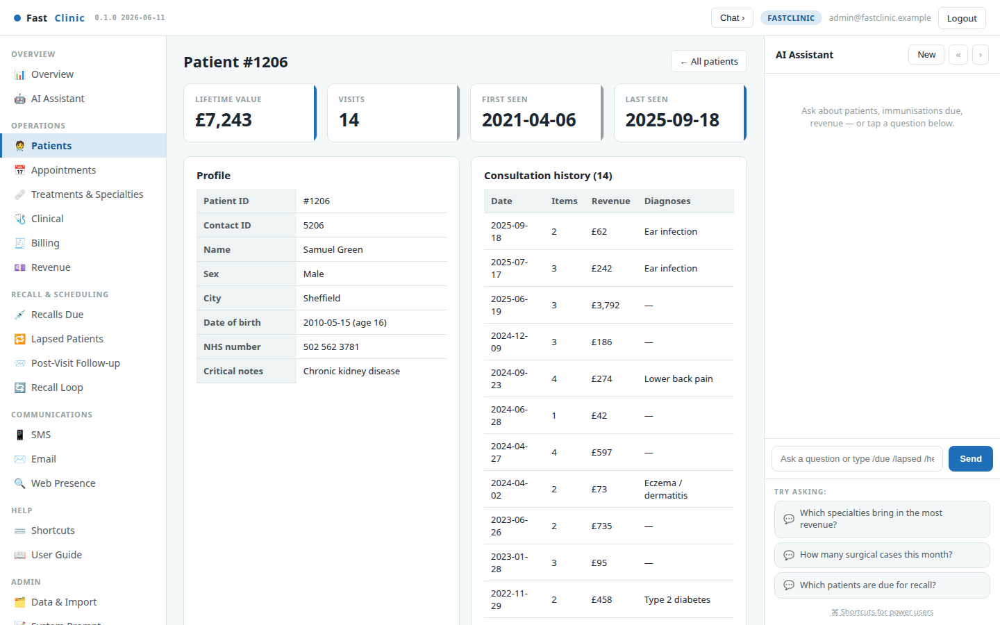

A single view of one patient: demographics and contact, lifetime value and visit
count, the full consultation history across every specialty they've seen, and
recent billed items — everything the team needs before a call or a visit.

---

## Clinical

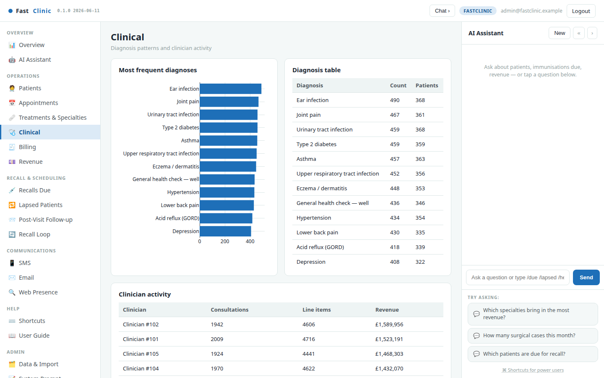

The clinical picture across the practice: the most common diagnoses and a
breakdown of activity by clinician. Useful for spotting trends, planning services,
and understanding where the clinical workload sits.

---

## Revenue

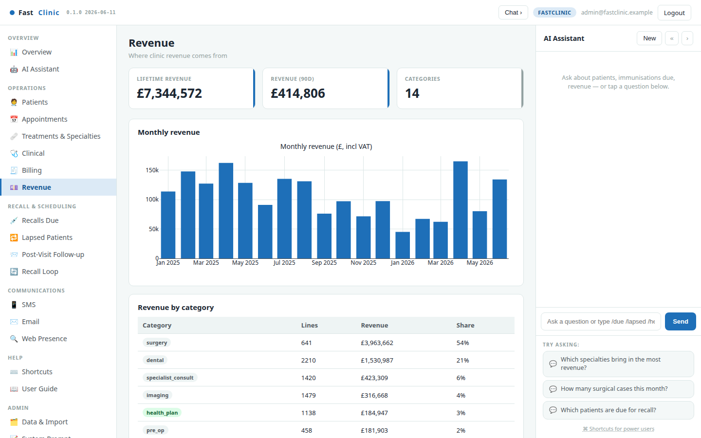

Where the money comes from: revenue by service category and the monthly trend.
See at a glance which kinds of work drive income and how the clinic is tracking
over time — the financial companion to the Treatments & Specialties view.

---

## Billing & payments

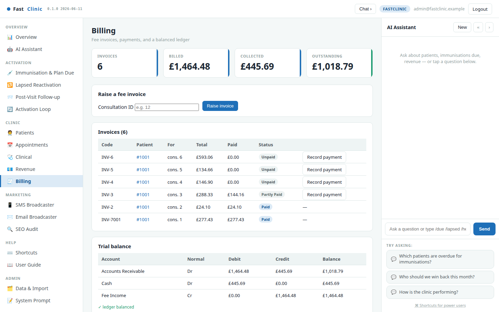

Raise **fee invoices** against consultations — from a routine GP visit to a
high-value surgical case — record **part or full payments**, and watch the numbers
stay honest: a live **balanced ledger** underneath means every pound billed and
collected is accounted for. Because the payer is tracked separately from the
patient, a parent's invoice for a child — or an insurer's — is handled naturally.

---

## Recalls Due

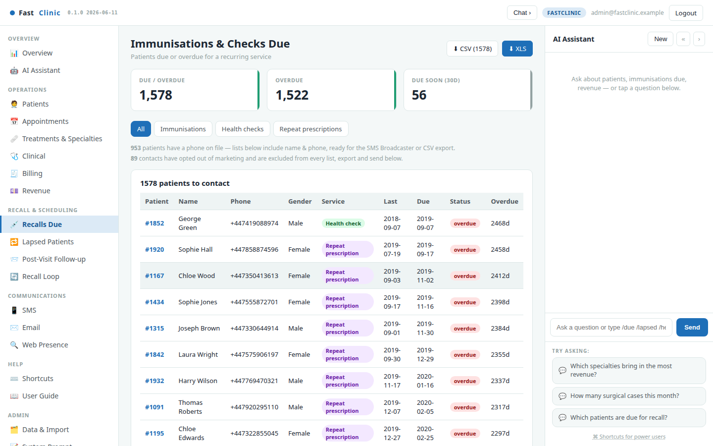

Recall keeps patients on track. This engine surfaces **exactly who is due or
overdue** for a recurring service — childhood and adult immunisations, annual
health checks, and repeat-prescription reviews — ranked most-overdue first.

Recall intervals are **age- and cohort-aware**: a flu booster for an over-65, a
childhood immunisation, and a medication review each follow their own schedule.
Each row comes with a drafted message, ready to send or export.

---

## Lapsed Patients

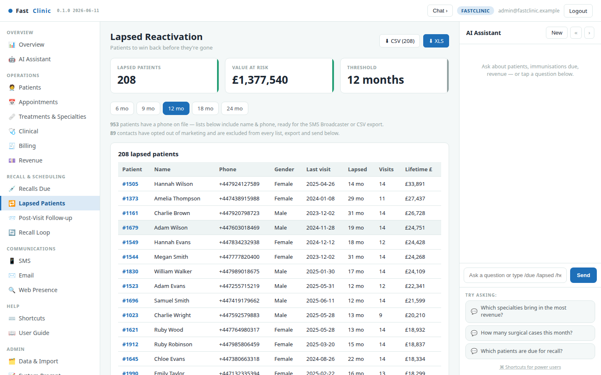

Good patients drift away quietly. **Lapsed Patients** lists everyone with no visit
in the last *N* months, ranked by lifetime value so you re-engage the most
valuable relationships first. Adjust the window (6 / 12 / 24 months) to widen or
tighten the net.

---

## Post-Visit Follow-up

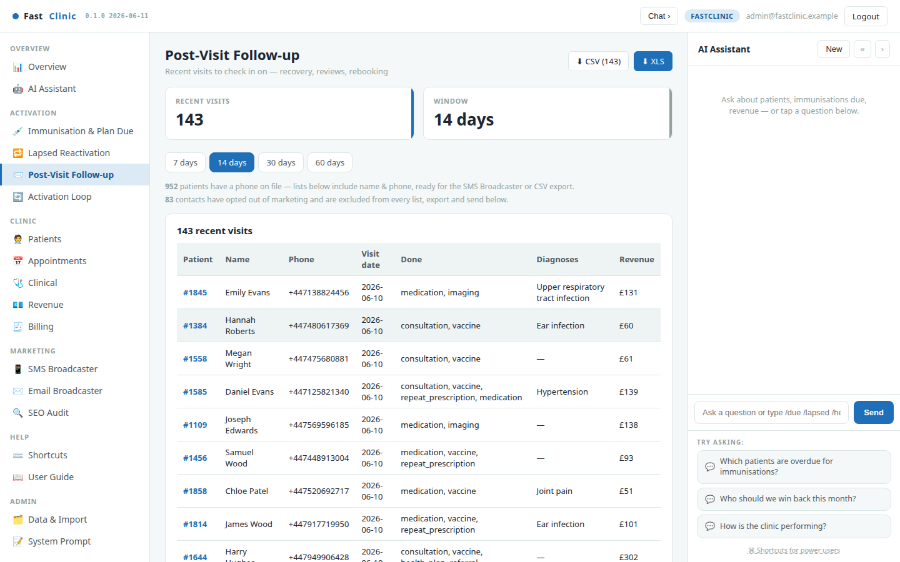

Care doesn't end when the patient leaves. **Post-Visit Follow-up** lists recent
visits — including post-operative reviews — so you can check on recovery, prompt a
review, or rebook within a window you choose (7 / 14 / 30 / 60 days).

---

## The Recall Loop — queue, send, measure

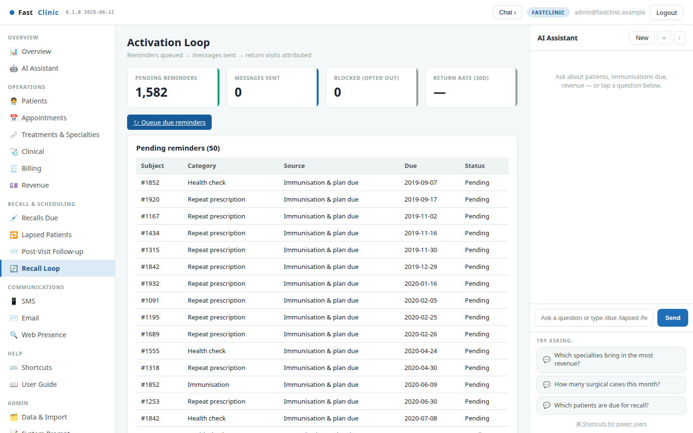

This closes the loop. **Queue due reminders** turns the recall lists into tracked
reminders. Every message you then send is **logged** — sent, failed, or **blocked
because the patient opted out** — so nobody is contacted twice and consent is
always respected. The scorecard tracks pending reminders, messages sent, blocked
contacts, and the **return rate**: how many contacted patients came back within 30
days.

---

## SMS & Email

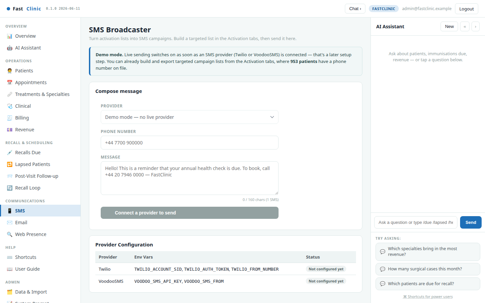

Send reminders through your SMS or email provider. Paste a drafted message from any
recall list, or write your own. Opted-out patients are **automatically suppressed**
at the point of sending, so a message never reaches someone who has asked not to be
contacted.

---

## AI Assistant

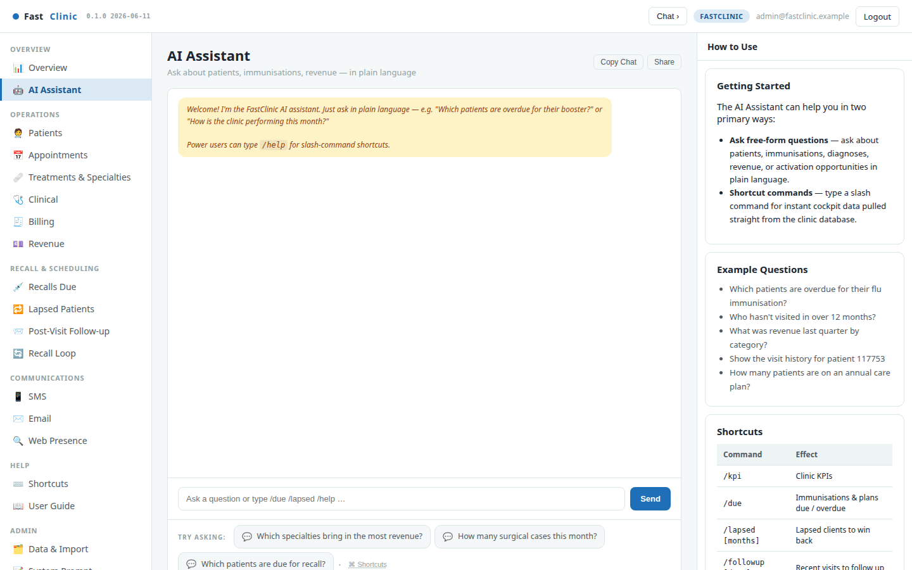

A full-page version of the Copilot for deeper questions. Ask about specialties,
revenue, scheduling or recall in plain language and get answers grounded in your
live data — a knowledgeable colleague who has read every record.

---

## Web Presence

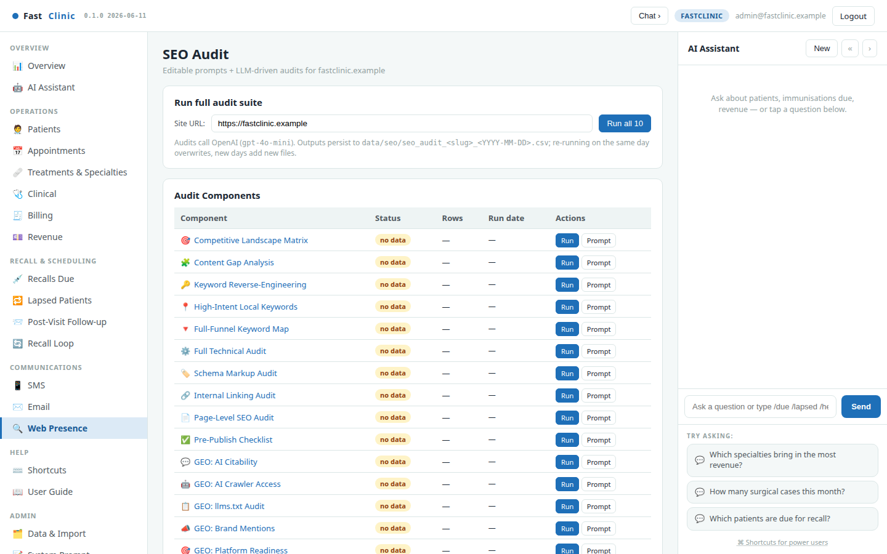

Grow the *top* of the funnel too. The audit suite checks how well your clinic shows
up in search and in AI answer engines, and writes dated reports you can act on — so
new patients can find you as easily as existing ones come back.

---

## Data & Import — keep the records fresh

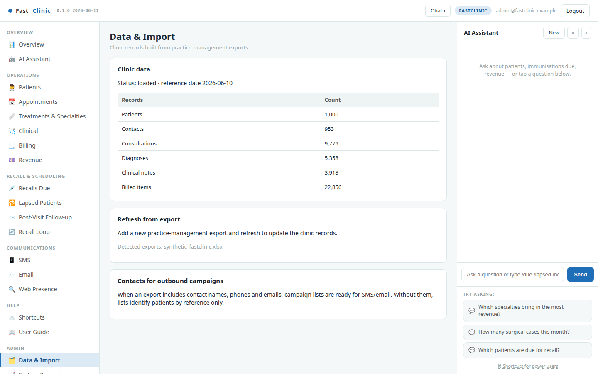

FastClinic works from your practice-management export. This page shows what's
loaded — patients, contacts, consultations and more — and how to refresh it when a
new export arrives. When contact details are included, recall lists are ready to
send.

---

## The weekly playbook

**A simple weekly rhythm keeps the clinic running well:**

1. **See.** Open the Overview, then **Treatments & Specialties** for the week's
   case mix and revenue by department.
2. **Schedule.** Work the Appointments board — fill slots, confirm bookings, keep
   surgical lists moving.
3. **Bill.** Raise invoices for the week's work and record payments; the ledger
   keeps itself balanced.
4. **Recall.** Queue due reminders on the Recall Loop, review the drafted messages,
   and send — opted-out patients are handled for you.
5. **Measure.** Check the Recall Loop's **return rate** and the Overview's active-
   patient and revenue trends.

> **The one question FastClinic answers every day:** *"How is the clinic running
> across every specialty — and what needs attention today?"*
